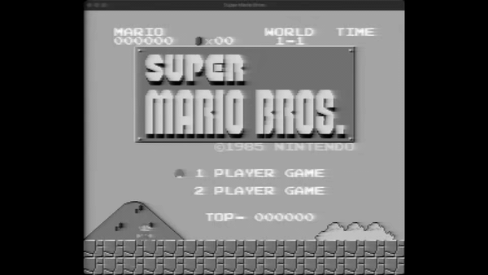

# obs-ntsc

An OBS Studio video filter that runs the [ntsc-rs](https://github.com/ntsc-rs/ntsc-rs)
NTSC / VHS effect on a source's frames. Written in Rust as an async video
filter, so it operates on the CPU-side frame buffer of webcams, media files,
and other async video sources.



## Status

v0.1. Built and tested on macOS / Apple Silicon against current OBS Studio
(libobs 32.x). The Rust source is portable and other platforms (Linux,
Windows, x86_64 macOS) are intended but not yet wired up in the build
recipes. Not yet packaged for distribution — there's a `justfile` for
building and installing locally.

## Features

- **Three tuned presets** — VHS (worn home-tape look with tracking-noise band,
  edge wobble, head-switching artifacts), Broadcast (clean off-air UHF),
  Composite (RCA-cable / dot-crawl look).
- **Custom presets** — load a `.json` file in the standard ntsc-rs preset
  format, including presets exported from the ntsc-rs standalone app.
- **Intensity slider** — scales the effect from a perfect pass-through at 0
  to the full preset at 1.
- **Color-correct on any source** — uses the per-frame color matrix OBS
  computes for the source, so BT.601, BT.709, and limited- vs full-range
  inputs all roundtrip without color shift.
- **Format coverage** — RGBA, BGRA, BGRX, UYVY, NV12. UYVY and NV12 are
  bridged through a reusable RGBA scratch buffer (most webcams deliver UYVY
  on macOS).

## Requirements

- macOS (current builds target Apple Silicon; see *Known limitations*)
- [OBS Studio](https://obsproject.com/) installed in `/Applications/OBS.app`
- Rust toolchain (`rustc`, `cargo`) — edition 2024
- [`just`](https://github.com/casey/just) for the build/install recipes

## Installation

```sh
just install
```

That builds the release dylib, packages it as a `.plugin` bundle, and
copies it to `~/Library/Application Support/obs-studio/plugins/obs-ntsc.plugin`.
First run also creates a `vendor/lib/libobs.0.dylib` symlink pointing at
OBS.app's framework binary — see the build notes below.

Restart OBS, then on any async video source (webcam, media source):

1. Right-click the source → **Filters**
2. Under **Effect Filters**, click **+**
3. Pick **NTSC / VHS Effect**
4. Choose a preset and adjust intensity

## Usage

The properties panel has these top-level controls:

- **Preset** — VHS / Broadcast / Composite / Custom... Picking a preset
  (re)populates every per-parameter slider in the **NTSC parameters** group
  below. Tweaks you make to those sliders persist; they're only overwritten
  when you change the preset selection.
- **Custom preset JSON** (only when **Custom...** is selected) — pick a
  `.json` file exported from the ntsc-rs standalone app, or any file in the
  same format. Its values are loaded into the sliders.
- **Intensity** (0.0–1.0) — scales magnitude fields and disables tape/noise
  blocks at near-zero values. At 0, the filter passes frames through
  untouched (no YUV roundtrip, no ntsc-rs work).
- **Save preset as...** — pick a path via the native save dialog. The
  current slider state is serialized to that file in the same JSON format
  the standalone app and the Custom-preset loader use, so it round-trips.
  The field clears itself after a successful save.

Below those, an **NTSC parameters** collapsible group exposes every
ntsc-rs parameter directly — chroma lowpass, head switching, tracking
noise, ringing, VHS tape settings, scale, etc. Labels, ranges, and enum
options come straight from ntsc-rs's own setting descriptors.

Bad / missing / unparseable JSON falls back to defaults and logs a
warning to the OBS log dock.

## Known limitations

- **Async sources only.** Game capture, display capture, and browser sources
  use OBS's GPU pipeline — this filter doesn't apply to them. Would require
  a sync (graphics-side) filter variant, deferred.
- **macOS / Apple Silicon is the only configuration currently built and
  tested.** No x86_64 build, no universal binary, no Linux or Windows
  packaging yet — those are intended but not wired up. The plugin won't
  load in an OBS running under Rosetta until we ship an x86_64 build.
- **Not codesigned.** macOS will refuse to load it on first launch unless
  you right-click → Open the OBS.app or trust the plugin manually.
- **CPU cost.** UYVY / NV12 sources pay a YUV → RGBA → ntsc-rs → YUV
  roundtrip. Fine at 720p / 1080p on Apple Silicon; not benchmarked at 4K.

## Building from source

```sh
just setup-libobs   # one-time: symlink libobs into ./vendor/lib
just build          # cargo build --release with LIBOBS_PATH set
just install        # build + package as .plugin bundle + install
```

### Why the libobs symlink

The `obs-sys` crate (which `obs-wrapper` depends on) was built against an
older OBS that shipped `libobs.0.dylib` as a flat dylib. Current OBS ships
`libobs.framework` instead. The `setup-libobs` recipe creates a symlink
named `libobs.0.dylib` inside `vendor/lib/` pointing at the framework's
actual binary, so the linker can satisfy the `-lobs.0` directive against
whatever version you have installed.

At runtime the plugin loads against `@rpath/libobs.framework/Versions/A/libobs`
(same as every other OBS plugin), so OBS's own rpath resolves it.

## Acknowledgments

- [ntsc-rs](https://github.com/ntsc-rs/ntsc-rs) by valadaptive — the engine
  doing the actual NTSC simulation.
- [rust-obs-plugins / obs-wrapper](https://github.com/bennetthardwick/rust-obs-plugins)
  by Bennett Hardwick — the Rust binding layer over `libobs`.

## License

GPL-2.0, inherited transitively from `obs-wrapper`. `ntsc-rs` itself is
MIT / ISC / Apache-2.0.
